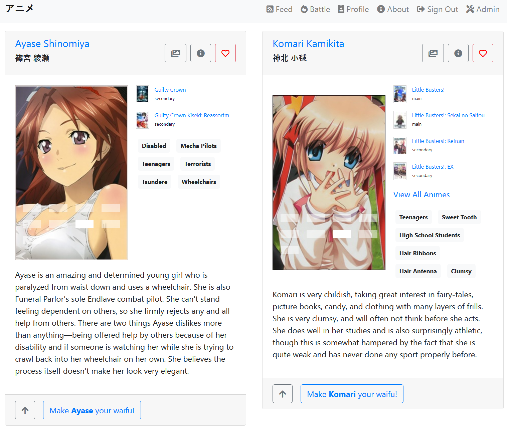
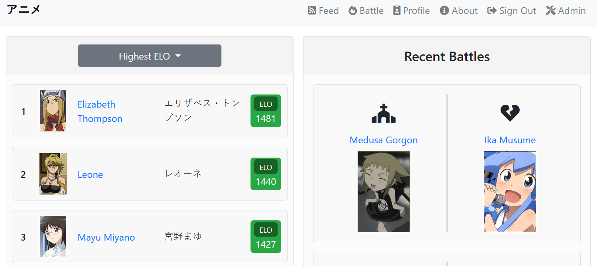
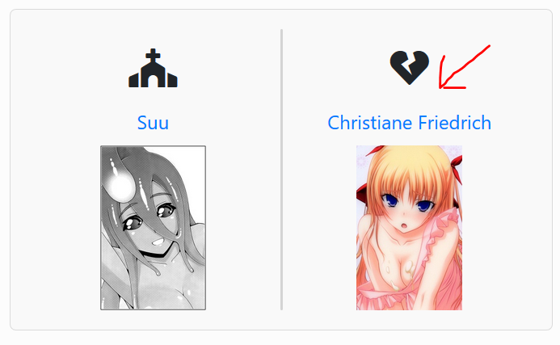
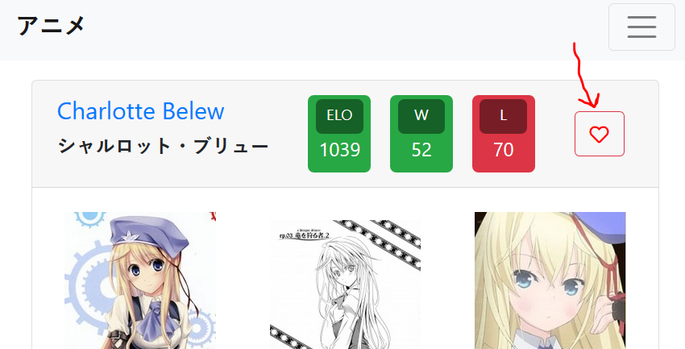
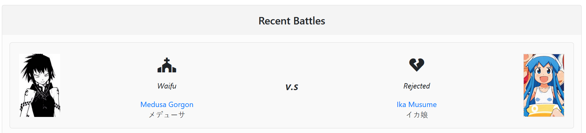
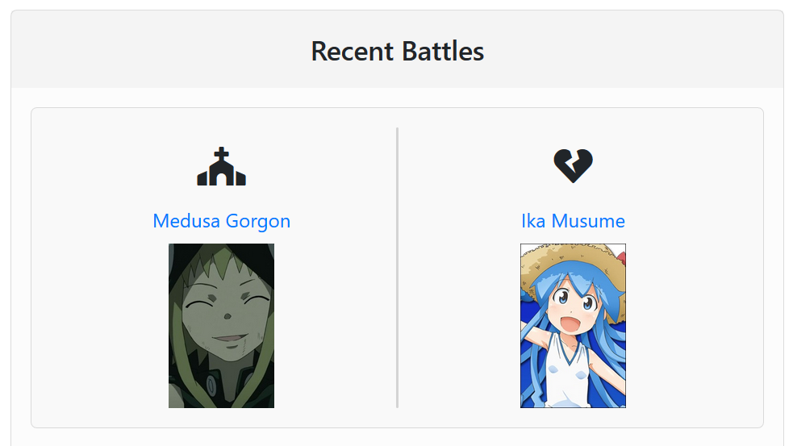

# animeu [](https://travis-ci.com/HennyH/animeu)
Battle of the anime babes!

# Setup

## Development

To set up a development environment fro the project you're encouraged to create a virtual environment and activate it during development. Regardless you will perform the following steps:

```bash
pip install -r requirements.<linux | windows>.dev.txt
pip install -e .
export FLASK_APP="animeu.app"
export FLASK_ENV="development"
export DATABASE="sqlite:///$(pwd)/app.db" # specify the SQLAlchemy compatible database URI to use as the apps db
export NO_HEADLESS=1 # show the browser window when running tests
```

You will also need a `character.json` file which contains all the characters - you can either re-create this file using the downloaders and extractors or use the one [here](https://drive.google.com/file/d/1ua7-Jb2RVaTDgjmuQZneGMz102GjthVc/view?usp=sharing). When you've downloaded the file ensure export a `DATA_FILE` env var with its location:

```bash
export DATA_FILE=characters.json
```

Now simply run the app:

```bash
(env) PS C:\Users\holli\Documents\Projects\animeu> flask run
 * Serving Flask app "animeu.app" (lazy loading)
 * Environment: development
 * Debug mode: on
 * Restarting with stat
 * Debugger is active!
 * Debugger PIN: 208-161-861
 * Running on http://127.0.0.1:5000/ (Press CTRL+C to quit)
USING DATABASE = sqlite:///C:/Users/holli/Documents/Projects/animeu/app.db
```

## Tests

To run the integration tests you will need a recent version of chrome and a suitable chromdriver binary in your `PATH`. If you have stable chrome then simply grab the latest chromdriver and place in a `drivers` folder and then run the tests like so:

```bash
coverage erase # remove any coverage files previously generated
PATH="$PATH:./drivers" python -Wignore -m unittest animeu.testings.integration_tests
coverage combine # merge the coverage results of all our subprocesses
coverage report # view the coverge results from the terminal
    ...
coverage html # generate a useful HTML report
python -m http.server # create a HTTP server exposing the current directroy
```

You can then navigate to `http://localhost:8000/htmlcov/index.html` (note that the port number may be different for your HTTP server...) to view the coverage results.

## Docker

A Dockerfile has been included which allows you to easily build an image which runs the site just as it is run in production. An example usage of this Dockerfile is:

```bash
docker build -t animeu .
docker run -p 5000:5000 \
           -e DATA_FILE=/home/data/characters.json \
           -e DATABASE="sqlite:////home/data/app.db" \
           -v "$HOME/animeu-data:/home/data" \
           -it animeu
```

The most important points to note here is exposing the default `5000` port and mounting a volume which contains a `characters.json` and then setting our `DATA_FILE` env var just like in development.

# Design

## What is Animeu?

Animeu is designed to be a fun site for showing love for anime characters and to find new anime. The characters of a show can sometimes be just as important as the plot in determining how enjoyable an anime might be. By allowing users to 'battle' characters off against each other and generate leaderboards a list of the most enjoyable characters will emerge. In addition the site was designed to display a lot of visual information to allow users to quickly see a lot of characters - untill they have love at first sight!

## What are these 'battles'?

A battle is the voting method in the app, from these battles various rankings are calculated. Each battle is simply the presentation of two anime characters, the user is then asked to choose which character they want to be their waifu. This choice results in both a winner (the waifu) and loser (the rejected character).

After one battle another is immedietly shown - allowing the user to quickly discover new characters. An important factor here is that characters are chosen for the battles randomly, this prevents characters becoming highly rated just because they are more _well known_!



## How do I see the top waifus?

You can view the rankings which are calulated from all the battles on the feed page. On the feed there are two sections:

1. *Leaderboard:* The leadboard offers a dropdown to select a type of ranking to use, and then displays the top characters according to that ranking.
2. *Recent Battles:* These are simply all the recent battles conducted by _any_ user - not just you!

The available ranking types are avaliable from the leaderboard dropdown:

1. *Highest ELO:* These are the characters with the greatest ELO rankings. ELO is a type of ranking algorithim used in competitive games such as Chess, League of Legends, DOTA, etc...
2. *Lowest ELO:* The expact opposite of _Highest ELO_, this shows the worst performing waifus according to their ELO ranks.
3. *Top Waifus:* These are the waifus with the most wins, regardless of how many losses they've had.
4. *Active Waifus:* These are the waifus who have seen the most battles.



## I want to know more about a cuite waifu I saw! Help me!

Don't worry, we understand how a waifu displayed in the feed may capture your heart at first sight. If you want to know more just click on their name and you'll be taken to their info page.




## How do I favourite a waifu?

You may have noticed on the profile page there is a 'Waifus for Laifu' list, this is a list of the waifus you have favourited. If you're wondering how to favourite a waifu simply click the love-heart shaped button near their name in either battle mode, or on their info card which is accessible by clicking a link with their name. To unfavourite them (meanie!) just press the button again.



# Development

There is quite a lot of ground to cover in terms of how the project was developed because a lot of additional work was done around acquiring character data for _most_ (we did our due dilligence by blacklisting ceartin tags!) anime characters, and in around configuring both CI with Travis and CD with Heroku. I'll give a quick overview of the different areas in semi-chronological order:

## Data Collection

An anime babe battle site wouldn't be very useful if there are no babes to battle! To solve this problem I decided to scrape both [Anime Planet](https://www.anime-planet.com/) and [My Anime List](https://myanimelist.net/). Part of the issue was MAL did not allow you to filter characters to only girls but had the better collection of pictures/metadata. This meant that we either had to download _every single_ character page on MAL just to then work out which ones to throw away because they were male. That would be extreemly inefficent especially because MAL lists extreemly minor (extras basically) characters. The solution to this problem was as follows:

1. Scrape AP which allows for filtering by gender.
2. Extract the metadata from the AP page(s).
3. Feed the AP extract into the MAL downloader to only visit known (anime, character) pairs.
4. Extact the metadata from the MAL page(s).
5. Fuzzy-match & combine the AP and MAL extracts to form a single `characters.json`

One particular design decision to note is that the extract format was 'normalized', so that an extract from either page could be used with the database however it would just be of lesser quality. This also made the 'merge' step nice and generic and composable `many extracts -> extract`.

All the scraping and extraction code are exposed via CLI programs as defined in `setup.py` - feel free to give them a try yourself.

## Travis CI

Everyone loves linting - and test are good also. I set up Travis CI so that we could lint all of your python to very strict standards and run our test code at every commit and before every merge. This allowed us to maintain a high quality of code throughout the project, and not leaving it all to the last minute!

The travis set up wasn't too complicated - except that some trickery was required to get a newer version of sqlite3 and compatible versions of chromium and chromium-webdriver installed. We use Xvfb as a virtual framebuffer in order to run our selenium based integration tests.

## Heroku Deployments

We used Heroku's docker support to easily build and deploy the site on every commit to master. We used a docker file so that we could test the builds locally without resorting to annoying buildpacks. On heroku we had to use a Postgres SQL database because the storage is ephemeral and would be wiped away on each container restart - someone could lose their newly discovered waifus! unacceptable!

## The 'App'  Itself

### Structure

We organised the project in a component-as-a-folder structure, where each component was some high level section of the site such as the feed, profile, elo rankings, admin tools, etc... This approach worked well with Flask's blueprints system and allowed for us to keep our template code (html, css, js) nearer to the python code responsible for handling that page.

```
/animeu
    /testing
    /spiders
    /api
    /battle
        /templates
        battle.py
        logic.py
        queries.py
    ...
    app.py
    models.py
```

Within each component we placed heavily database related code into a `queries.py` file and the controller code in `logic.py`. Care was taken the avoid the use of unnessacery OOP, instead I wrote the python code in a more functional style - allowing for mor easy code re-use between pages. I think it is also conceptually simpler, more composable and in principle easier to test.

### All The Macros!

We made heavy use of macros and the `call` templating method in our templates. This allowed us to have massive amounts of code reuse - for example the battle page's template was simply:

```jinja

    
        
        
            
                <div class="card-footer">
                    <button type="button" class="btn btn-outline-secondary jump-to-top">
                        <i class="fas fa-arrow-up"></i>
                    </button>
                    <form method="POST" action="{{ url_for('battle_bp.submit_battle') }}">
                        {{ form.csrf_token(id=id+"csrf") }}
                        {{ form.winner_name(id=id+"winner", required=False) }}
                        {{ form.loser_name(id=id+"loser", required=False) }}
                        <button class="btn btn-outline-primary proposal-button">
                            Make <b class="proposal-name">{{ en_name.split() | first }}</b> your waifu!
                        </button>
                    </form>
                </div>
            
        
    
    <section class="battle-grid">
        {{ battle_card("left", left, left_form) }}
        {{ battle_card("right", right, right_form) }}
    </section>

```

You may be thinking why are there `is_header`, `is_body` type varaibles being passed into the caller? Well the answer is because we wanted multi-slot transclusion to override or enhance specific parts of a templated macro. This technique allowed us to significantly improve the extensibility of our macros and improve code re-use.

### Bootstrap Grid System? No Thanks!

You may have noticed that the site has a very responsive design - it doesn't just wrap content around when a fixed breakpoint is reached (the bootstrap approach), no, no, we go much further than that! We will _change_ the design of components based on viewport constraints! For an example of this just take a look at the feed's battle card summaries and how they transition:

#### On a desktop with the window expanded...



#### To on the same desktop with the window shrunk (but before the cards warp!)



This allows users to view the two lists side-by-side on a wider range of displays (seeing the picture/name/win/loss is the main information) before laying out the cards one atop the other. To achieve this the whole site was built of CSS Grid. The use of CSS grid was also critical to our template and CSS re-use as we often wanted the same elements to be displayed but in different positions, and/or with additional content added (e.g more counters in the win/loss v.s the ELO leaderboard). We could then override the grid properties to display the content as needed. Awesome!